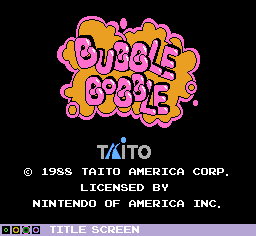

<div align="center">
   
</div>

## Description 
The specific project is a simple variation of an old video game Bubble Bobble developed in C++ using the <a href="https://cgaueb.github.io/sgg/index.html">SGG (Simple Game Graphics)</a> Library. It is a single player game, with the goal to collect all the gems without colliding with the enemies.

## Rules
- Press ENTER to start the game
- To move left and right you use the A and D keys and to jump W
- You have 5 lives
- You need to dodge the moving enemies
- If you lose all of the 5 lives, you lose the game
- The goal is to collect all the gems to win the game

## How to Run
To run this Bubble-Bobble game project, follow these steps:

1. Clone the Repository:
```
git clone https://github.com/nayafyt/Bubble-Bobble.git
cd Bubble-Bobble
```
2. Install Dependencies:

> Ensure you have the SGG (Simple Game Graphics) Library installed on your system.
  Follow the instructions on the SGG library website for installation.

3. Build the Project:

- Use a C++ compiler that supports the SGG library. 
- Compile the project source files. For example, if using g++, you can run:
```
g++ -o BubbleBobble main.cpp -lsgg
```

4. Run the Game:
Execute the compiled binary:
```
./BubbleBobble
```


